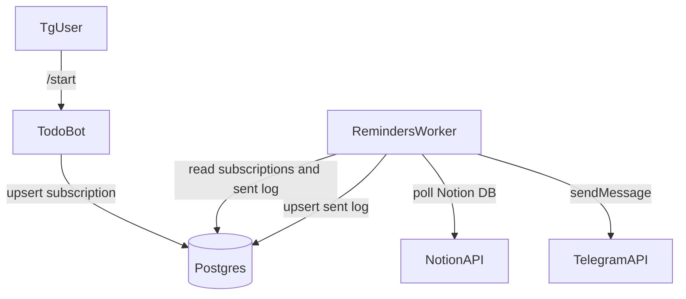

#Reminders worker + Notion Tasks DB update

## Goals

- Send Telegram reminders based on the **Tasks DB**.
- Default behavior:
- Daily reminder at **11:00** (Europe/Moscow) for tasks due today and Inbox.
- Reminder **60 minutes before** a due datetime if the task has time.
- задачи без времени, но с датой - накануне события (в 23:00 часа)
- Store state in **Postgres** to avoid duplicates and survive restarts.
- Update repo references to the new Tasks DB URL: `https://www.notion.so/web3-future/2d6535c900f08191a624d325f66dbe7c?v=2d6535c900f08188b3cf000c5b8f5039`.

## Non-goals (this sprint)

- Pull events from the Notion Calendar DB (we will add a clean hook for it later).
- разобраться, как работает Notion Calendar, можно ли тянуть его события из обычного API Notion. (изучить доки Notion, обновить план)
- Webhooks, n8n orchestration.

## Design

### Data flow

### Reminder rules (defaults)

- **Daily at 11:00** (TG_TZ, default Europe/Moscow)
- include: tasks with dueDate = today (date-only or date-time)
- plus: tasks in Inbox
- exclude: Done and Deprecated
- **Before due datetime**
- if task has due datetime with time: send at dueTime - 60 minutes
- only if remindAt is in the next lookahead window

### Deduplication

- Postgres table `sent_reminders` keyed by `(chat_id, page_id, reminder_kind, remind_at)`
- Worker sends only if no row exists.

## Implementation steps

### 1) Update Tasks DB link and fallback id

- Replace old Tasks DB URL in:
- [README.md](README.md)
- [docs/index.md](docs/index.md)
- [docs/roadmap/index.md](docs/roadmap/index.md)
- Update fallback database id in [apps/todo_bot/src/main.js](apps/todo_bot/src/main.js) from `2d3535c900f0818ebc77fd1fd3d9d6fa` to `2d6535c900f08191a624d325f66dbe7c`.
- Ensure docs mention the new default DB id:
- [docs/current/index.md](docs/current/index.md)

### 2) Add Postgres schema for reminders

- Add SQL migrations under `infra/db/migrations/`:
- `subscriptions` (chat_id, bot_mode, enabled, created_at, updated_at)
- `sent_reminders` (chat_id, page_id, reminder_kind, remind_at, created_at)

### 3) Store chat subscription on /start and add toggle commands

- In [core/dialogs/todo_bot.js](core/dialogs/todo_bot.js):
- On `/start`, upsert chat_id into Postgres (enabled=true).
- Add `/reminders_on` and `/reminders_off` to toggle enabled flag.

### 4) Implement separate reminders worker

- New app: `apps/reminders_worker/`
- `package.json` with deps: `pg`, `node-telegram-bot-api` (or direct Telegram HTTP), reuse `dotenv` + `core/runtime/env`.
- `src/main.js`:
    - load env
    - connect Postgres
    - poll Notion Tasks DB via existing [core/connectors/notion/tasks_repo.js](core/connectors/notion/tasks_repo.js)
    - compute reminder candidates
    - for each subscribed chat, send reminders, upsert sent log

### 5) Configuration (env)

- `TG_TZ` (already used)
- `TG_REMINDERS_DAILY_AT=11:00`
- `TG_REMINDERS_BEFORE_MINUTES=60`
- `TG_REMINDERS_LOOKAHEAD_HOURS=24`
- `TG_REMINDERS_POLL_SECONDS=60`
- `POSTGRES_URL` (or host/user/pass/db vars)

### 6) Docs and execution history

- Update docs:
- [docs/current/bot-ui.md](docs/current/bot-ui.md) with new commands.
- Add `docs/current/reminders.md` describing current reminder behavior.
- Update logs:
- [CHANGELOG.md](CHANGELOG.md)
- [HISTORY.md](HISTORY.md)
- Add new sprint writeup in `execution_history/` and update [execution_history/index.md](execution_history/index.md)

## Validation checklist

- Start Postgres via `infra/docker-compose.yml`.
- Run todo bot and execute `/start` in Telegram, verify subscription row exists.
- Run reminders worker locally.
- Create tasks in Notion:
- due date today (date-only)
- due datetime today + time
- Inbox task
- Done task
- Expected:
- daily 11:00 reminders include due today + Inbox, exclude Done
- 60-min reminder triggers only for timed due dates
- restarts do not duplicate already sent reminders