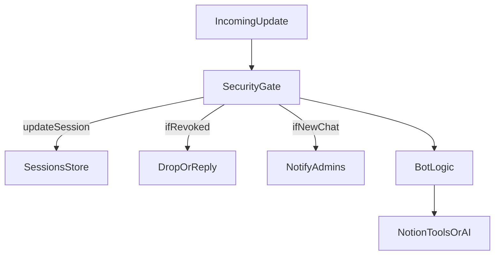

#

План: безопасность (sessions, notify, revoke)

## Цели

- **Уведомления админам** о первом контакте нового chatId и о важных событиях (revoke, unrevoke).

- **Реестр известных чатов (sessions)**: хранить метаданные и last_seen.

- **Revoke**: возможность отключать конкретный chatId (бот игнорирует сообщения из него).

- **Закладка под allowlist** без включения по умолчанию (структура и конфиги, чтобы позже добавить enforce).

## Ограничения и реальность Telegram

- Telegram Bot API **не дает надежный device id**. “Сессия” здесь будет означать **chatId + метаданные из апдейтов** (from.id, username, chat.type, title), и timestamps first_seen/last_seen.

## Конфигурация

- **`TG_ADMIN_CHAT_IDS`**: список chatId админов через запятую, например `123,456`.

- **`TG_SECURITY_STORE`**: `auto` (default). `auto` = Postgres если есть `POSTGRES_URL`, иначе file.

- **`TG_SECURITY_FILE_PATH`** (fallback): путь до файла хранилища (в поддиректории проекта, не в корне), например `data/security/sessions.json`.

- **Закладка**: `TG_SECURITY_ALLOWLIST_MODE=off|warn|enforce` (default `off`). В этом спринте оставляем `off`, но проектируем код так, чтобы можно было включить позже.

## Хранилище данных

- **Postgres (если есть `POSTGRES_URL`)**

- Миграция: `infra/db/migrations/003_chat_security.sql`

- Таблица `chat_security_chats`:

    - `chat_id bigint primary key`

    - `first_seen_at timestamptz`

    - `last_seen_at timestamptz`

    - `chat_type text`, `chat_title text`

    - `last_from_user_id bigint`, `last_from_username text`

    - `revoked boolean default false`, `revoked_at timestamptz`, `revoked_by_chat_id bigint`, `revoked_reason text`

    - поля под allowlist: `allowlisted boolean default false`, `allowlisted_at timestamptz`, `allowlisted_by_chat_id bigint`

- Таблица аудита `chat_security_audit` (минимальная):

    - `id bigserial primary key`, `ts timestamptz`, `actor_chat_id bigint`, `action text`, `target_chat_id bigint`, `details jsonb`

- **Fallback file (если Postgres нет)**

- Файл: `data/security/sessions.json` (или другой путь через `TG_SECURITY_FILE_PATH`).

- Формат JSON: `{ "chats": { "<chatId>": {...} }, "audit": [ ...lastN ] }`.

## Логика в боте

- Встраиваем слой безопасности на входе каждого апдейта:

- обновить/создать запись в sessions store (first_seen/last_seen, username, title)

- если chat revoked: **не обрабатывать команды/AI**, отвечать коротко (или молча) и отправлять событие админам (с rate limit).

- если chat новый: отправить **notify админам**.

## Команды (admin only)

- `/sessions` - показать последние N чатов (по last_seen), с флагом revoked.

- `/revoke <chatId> [reason]` - отключить чат.

- `/revoke_here [reason]` - отключить текущий чат.

- `/unrevoke <chatId>` - включить обратно.

- `/security_status` - показать активный backend (pg/file), количество известных чатов, количество revoked.

## Уведомления

- Формат уведомления админам:

- `New chat detected` (chatId, type, title, from.username, from.id, first_seen)

- `Chat revoked/unrevoked` (кто, кого, причина)

- Защита от спама:

- notify о new chat только 1 раз

- notify о repeated messages из revoked - не чаще 1 раза в X минут

## Маскирование секретов

- Убедиться, что любые логи ошибок проходят через `sanitizeErrorForLog`/`sanitizeForLog`, чтобы токен в URL вида `https://api.telegram.org/bot<token>/...` не попадал в вывод.

## Документация

- Добавить `docs/current/security.md`:

- что такое sessions в нашем понимании

- команды /sessions /revoke

- переменные окружения

- Обновить `docs/current/index.md` ссылкой на security.

- Записать sprint в `execution_history/YYYY-MM-DD_...` и обновить `execution_history/index.md`.

## Диаграмма потока

## Основные файлы, которые будем менять

- [`core/dialogs/todo_bot.js`](core/dialogs/todo_bot.js) - подключить security gate, admin commands.

- [`apps/todo_bot/src/main.js`](apps/todo_bot/src/main.js) - передать `TG_ADMIN_CHAT_IDS` и конфиг security (если нужно).

- [`core/connectors/postgres/`](core/connectors/postgres/) - новый `chat_security_repo.js`.

- [`infra/db/migrations/003_chat_security.sql`](infra/db/migrations/003_chat_security.sql) - миграция.

- [`core/runtime/`](core/runtime/) - `security_store_file.js` (fallback json) и общий интерфейс store.

- [`docs/current/security.md`](docs/current/security.md) и ссылки в индексах.

## Implementation todos

- security-store: Реализовать интерфейс store + Postgres repo + file fallback

- security-gate: Интегрировать gate в входящие апдейты, обновлять sessions, блокировать revoked

- security-admin-cmds: Добавить /sessions /revoke /unrevoke /security_status (admin only)