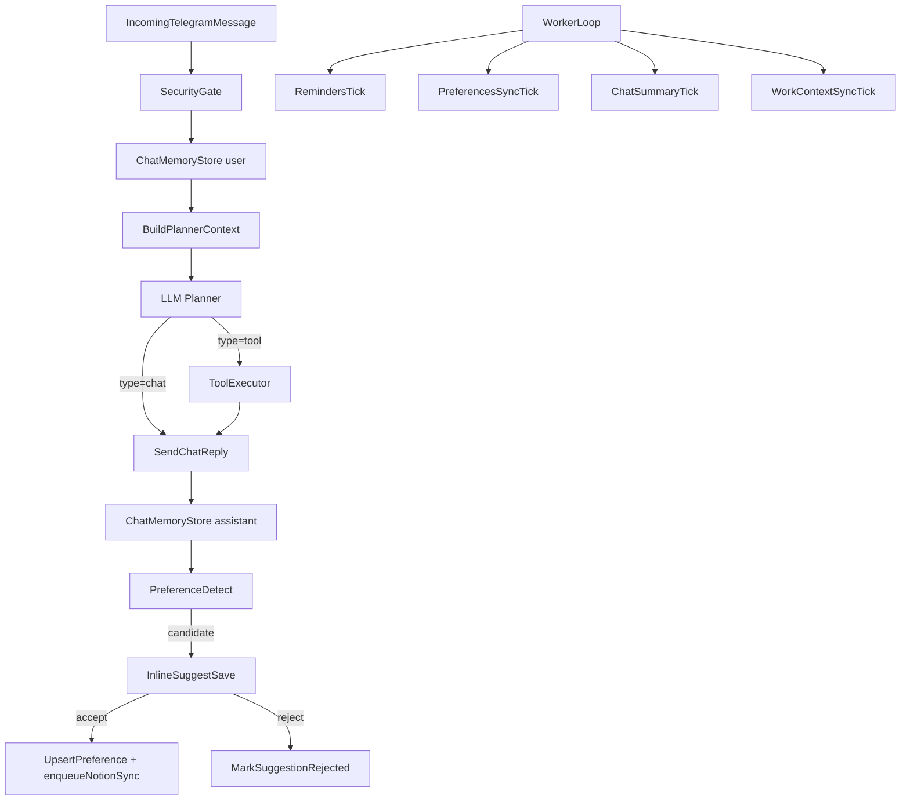

# План: ctx + memory + preferences extractor (auto)

## Контекст (что уже есть)

- Есть отдельные процессы:
- `apps/todo_bot` (polling бот)
- `apps/reminders_worker` (напоминания + memory sync)
- Notion домены уже подключены через официальный API (без MCP в проде): Tasks, Ideas, Social, Journal.
- В Postgres уже есть:
- дедуп напоминаний (`subscriptions`, `sent_reminders`)
- security sessions/revoke (`chat_security_*`)
- preferences + sync очередь в Notion (`preferences`, `preferences_sync`, `notion_sync_queue`)
- В planner уже подмешивается **preferences summary** (из Postgres) через `memorySummary`.

## Цели

1) **Память диалога в Postgres**: хранить последние N сообщений + summary, чтобы агент помнил контекст переписки и мог продолжать обсуждение.2) **Preferences extractor (как в Cursor)**:

- при явном запросе типа "запомни" сохранять preference
- при неявных формулировках предпочтений предлагать сохранить (inline кнопки)

3) **Рабочий контекст (ctx) только когда нужно**:

- режим `work_context_mode=auto` (по умолчанию)
- ctx подмешивается в planner только для обсуждений/рекомендаций/планирования, но не для простых CRUD команд
- Journal в ctx не подмешиваем, только по явному запросу

4) **Pre-prod надежность без Docker**:

- health checks (как отдельные CLI команды)
- единообразное логирование (sanitized)
- единая dev оркестрация (одна команда запускает bot + worker)

5) **Docker Compose для prod** делаем последним шагом плана.

## Политика инъекции контекста

### 1) Всегда подмешиваем (легкий слой)

- preferences summary (как сейчас)
- диалоговую память: summary + последние N сообщений (коротко)

### 2) Подмешиваем только в `auto` режиме при подходящем intent (тяжелый слой)

Триггеры (эвристика на тексте пользователя):

- обсуждение: "обсуди", "посоветуй", "как лучше", "помоги выбрать", "приоритизируй", "давай план", "что делать", "проанализируй"
- запрос на рекомендации/улучшения: "улучши", "оптимизируй", "сделай лучше", "предложи"
- контент стратегии: "о чем писать", "контент план", "посты", "соцсети" (тут добавляем Social ctx)

Не подмешиваем тяжелый ctx когда:

- простое действие: "добавь задачу", "создай", "переименуй", "пометь done" (CRUD)
- короткие команды (`/list`, `/today` и т.п.)

### 3) Journal

- не подмешиваем в рабочий ctx
- подмешиваем только когда запрос явно про дневник/рефлексию

## Данные в Postgres (новые сущности)

### A) Память диалога

Новые миграции (следующие номера после текущих):

- `006_chat_memory.sql`
- `chat_messages`:
    - `id bigserial`, `chat_id bigint`, `role text` (user|assistant|system)
    - `text text` (уже sanitized), `tg_message_id bigint null`, `created_at timestamptz`
    - индексы: `(chat_id, created_at desc)`, `(chat_id, tg_message_id)`
- `chat_summaries`:
    - `chat_id bigint primary key`
    - `summary text`, `updated_at timestamptz`, `last_message_id bigint`

Параметры:

- `TG_CHAT_MEMORY_LAST_N` (default 50)
- `TG_CHAT_MEMORY_TTL_DAYS` (default 30)

### B) Предложение сохранить preference

Новая миграция:

- `007_memory_suggestions.sql`
- `memory_suggestions`:
    - `id bigserial primary key`
    - `chat_id bigint`
    - `kind text` (preference)
    - `candidate jsonb` (key, scope, category, value_human, value_json, confidence, reason)
    - `candidate_hash text` (hex, stable hash from canonical JSON)
    - `status text` (pending|accepted|rejected)
    - `source_message_id bigint null` (tg)
    - `created_at`, `decided_at`
    - unique для антиспама: `(chat_id, kind, status, candidate_hash)`

### C) Рабочий ctx (кэш)

Новая миграция:

- `008_work_context_cache.sql`
- `work_context_cache`:
    - `chat_id bigint not null`
    - `key text not null` (например `tasks_15d`, `ideas_recent`, `social_window`)
    - `payload jsonb`
    - `payload_hash text`
    - `updated_at timestamptz`
    - primary key: `(chat_id, key)` (строго per chat_id)

Окна:

- Tasks: 15 дней вперед (плюс overdue + Inbox)
- Social: окно -10..+10 дней вокруг сегодня
- Ideas: последние N по last_edited_time (или по status)

## Потоки (как это будет работать)

## Реализация по шагам (что меняем в коде)

### 1) Chat memory: запись и чтение

- Добавить `core/connectors/postgres/chat_memory_repo.js`:
- `appendMessage`, `listLastN`, `getSummary`, `upsertSummary`, `purgeOld`
- использовать sanitize для storage (см. ниже)
- Встроить в `core/dialogs/todo_bot.js`:
- при каждом входящем сообщении писать user text
- после ответа (chat/tool) писать assistant text
- важно: ассистентские сообщения сейчас отправляются из разных мест (`todo_bot.js`, `todo_bot_executor.js`, `todo_bot_callbacks.js`, voice). Чтобы не пропустить, делаем единый слой отправки:
    - вариант A (предпочтительно): обертка над `bot` (proxy), которая перехватывает `sendMessage` (и при необходимости `editMessageText`) и пишет в `chat_messages`
    - вариант B: вводим `sendAndStore()` и постепенно переводим все `bot.sendMessage` на него (более инвазивно)
- перед `planAgentAction` собирать:
    - preferences summary (как сейчас)
    - chat summary + last N (короткий формат)

### 2) Chat summary: асинхронная сводка

- Добавить `core/ai/chat_summarizer.js` (LLM JSON формат: `{summary: string}`)
- В `apps/reminders_worker/src/main.js` добавить `chatSummaryTick()`:
- выбирать чаты с новой активностью (по `chat_messages`)
- обновлять `chat_summaries`
- чистить TTL
- важно: не блокировать напоминания. Делаем tick с лимитом по времени и по количеству чатов за запуск (batch), без длинных последовательных LLM вызовов.

### 3) Preference extractor + UX подсказки

- Добавить `core/ai/preference_extractor.js`:
- вход: `userText`, (опционально) last N сообщений и текущие preferences
- выход: список candidates (1-3 max) с `confidence` и `reason`
- В `core/dialogs/todo_bot.js`:
- явный триггер: если текст содержит "запомни" или "пожалуйста всегда" и т.п. -> extractor вызываем всегда
- неявный режим: вызываем extractor только если сработал быстрый regex-триггер (чтобы не дергать LLM на каждое CRUD)
- если candidate есть -> создаем запись в `memory_suggestions` и показываем inline кнопки:
    - "Сохранить"
    - "Не сохранять"
- В `core/dialogs/todo_bot_callbacks.js`:
- обработка accept/reject по id suggestion
- accept: `PreferencesRepo.upsertPreference(..., source='postgres')` + `PreferencesRepo.enqueueNotionSync(kind='pref_page_upsert', ...)`
- reject: пометить suggestion как rejected, чтобы не спамить повторно

### 4) Work ctx cache + auto injection

- Добавить `core/connectors/postgres/work_context_repo.js` (или использовать прямой доступ через новый repo)
- В `apps/reminders_worker/src/main.js` добавить `workContextTick()`:
- tasks: использовать `NotionTasksRepo.listTasks` с date-range (уже есть)
- social: `NotionSocialRepo.listPosts` с date window
- ideas: `NotionIdeasRepo.listIdeas` (recent)
- собирать компактный payload (10-20 строк максимум) и писать в `work_context_cache`
- В `core/dialogs/todo_bot.js` перед `planAgentAction`:
- вычислять intent (простые эвристики)
- если `work_context_mode=auto` и intent подходит -> подмешивать work ctx в отдельный блок `Work context:`
- строго per chat_id: worker пишет кэш для конкретного `chat_id`, бот читает только свой `chat_id`

### 5) Sanitize и безопасность хранения

- Перед записью `chat_messages.text` прогонять через отдельный sanitize для storage (не равен `sanitizeForLog`):
    - редактируем telegram bot token как в URL, так и в "голом" виде (`123456:...`)
    - редактируем Notion token (`ntn_...`)
    - редактируем OpenAI API key (`sk-...`, `sk-proj-...`)
    - редактируем любые `Authorization: Bearer ...` строки
- Добавить предпочтение-флаг: `chat_memory_enabled` (по умолчанию true), чтобы можно было отключить сбор памяти на chat_id.

### 6) Health checks, restart policy, логирование (до Docker)

- Добавить CLI healthcheck команды:
- проверка Notion доступности нужных DB ids
- проверка Postgres подключения и миграций (наличие таблиц)
- проверка Telegram send (best-effort в admin chat)
- Привести логи к одному стилю:
- в bot и worker: логировать события коротко и через `sanitizeForLog`

### 7) Dev оркестрация (одна команда)

Варианты, выберем самый простой:

- `apps/dev_runner` (node скрипт, который spawn-ит `apps/todo_bot` и `apps/reminders_worker`)
- или расширить `.cursor/commands/*` командой, которая запускает оба процесса в двух терминалах

### 8) Docker Compose для prod (последним этапом)

- Собираем `agent-core` (todo_bot) + `worker` + `postgres`
- Подключаем healthcheck команды
- Настраиваем restart policy и логирование контейнеров

## Документация и логи изменений

После каждого смыслового этапа:

- обновлять `docs/current/memory.md` (добавить chat memory + extractor + ctx policy)
- обновлять `docs/current/ai.md` (когда подмешивается ctx, journal only on demand)
- обновлять `docs/current/commands.md` (команды запуска и healthcheck)
- писать `execution_history/YYYY-MM-DD_*.md`
- bump версии `apps/todo_bot/package.json`

## Критерии готовности

- Бот помнит последние N сообщений и summary после рестарта (Postgres).