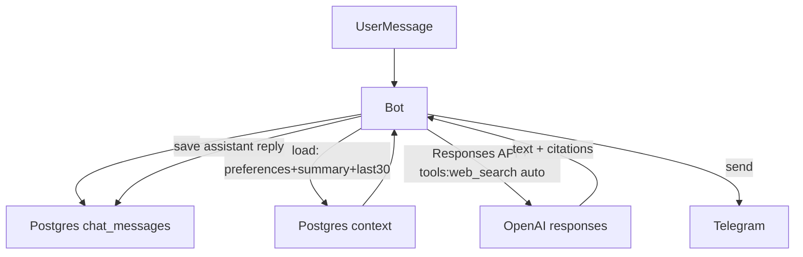

# План: ChatGPT 5.2 + web_search с нашей памятью (Postgres)

## Цель

Сделать отдельный режим для админ чатов: бот отвечает как ChatGPT на `gpt-5.2-chat-latest`, при необходимости использует встроенный `web_search` (Responses API), и при этом подмешивает контекст из нашей памяти (Postgres): **preferences + summary + последние 30 сообщений**.

## Выбранная развилка

- **Режим ChatGPT web не вызывает Notion tools** (вариант B). Для Notion действий пользователь переключается обратно в обычный агентский режим.
- Кнопка доступна **только админ чатам**.

## Поток данных (как будет работать)

## Изменения в коде

- **Хранилище режима (пер чат, Postgres)**
  - Добавить таблицу `chat_ai_settings` (chat_id PK, mode, updated_at).
  - Реализовать репозиторий чтения/записи.
  - Файлы:
    - `infra/db/migrations/009_chat_ai_settings.sql`
    - `core/connectors/postgres/chat_ai_settings_repo.js`

- **Вызов OpenAI Responses API с web_search**
  - Расширить клиент OpenAI новой функцией `callResponses` (POST `/v1/responses`).
  - Включать `tools: [{ type: "web_search" }]` и оставлять поведение **auto** (модель сама решает, когда искать).
  - Собрать итоговый текст из output items и аккуратно добавить блок **Источники** (если в ответе есть цитаты).
  - Файл:
    - `core/ai/openai_client.js`
    - опционально вынести сборку ответа в `core/ai/chatgpt_web_responder.js`

- **Роутинг сообщений в зависимости от режима**
  - В `todo_bot` добавить проверку режима чата: если включен ChatGPT web, то обходить planner (`planAgentAction`) и отвечать через Responses.
  - Подмешивать контекст из Postgres: summary + preferences + last 30.
  - Писать в память и user, и assistant сообщения.
  - Поддержать то же для voice: если режим включен, voice транскрипт тоже идет в Responses.
  - Файлы:
    - `core/dialogs/todo_bot.js`
    - `core/dialogs/todo_bot_voice.js`

- **Кнопки переключения (админ чат)**
  - В `handleStart` добавить две кнопки рядом с существующими (по аналогии с `Тест задачи: ВКЛ/ВЫКЛ`):
    - `ChatGPT web: ВКЛ`
    - `ChatGPT web: ВЫКЛ`
  - Обработчики `bot.onText(...)` для переключения режима в Postgres и подтверждающее сообщение.
  - Файл:
    - `core/dialogs/todo_bot.js`

## Документация и версии

- Поднять версию todo bot (`apps/todo_bot/package.json`) так, чтобы `/start` показывал обновление.
- Обновить RU документацию:
  - `docs/current/ai.md`: что делает режим ChatGPT web, что web_search используется только при необходимости, какие источники выводим.
  - `docs/current/commands.md` или `docs/current/bot-ui.md`: как включить/выключить режим (только админ).
- Обновить логи изменений:
  - `CHANGELOG.md`, `HISTORY.md`
  - новая запись в `execution_history/YYYY-MM-DD_*.md` + обновление `execution_history/index.md`

## Ручные проверки

- **Переключение**: нажать `ChatGPT web: ВКЛ`, затем задать вопрос на актуальные факты и увидеть источники.
- **Память**: спросить про ранее обсужденное предпочтение и убедиться, что оно используется (без web поиска).
- **Условность web_search**: задать вопрос, который не требует поиска, и убедиться, что ответ быстрый и без источников.
- **Выключение**: `ChatGPT web: ВЫКЛ` и убедиться, что снова работает обычный агентский режим.

## Риски и как их снимем

- **Формат Responses output** может отличаться: делаем парсер устойчивым, с fallback на безопасное извлечение текста.
- **Стоимость**: режим только для админ чатов, по кнопке.