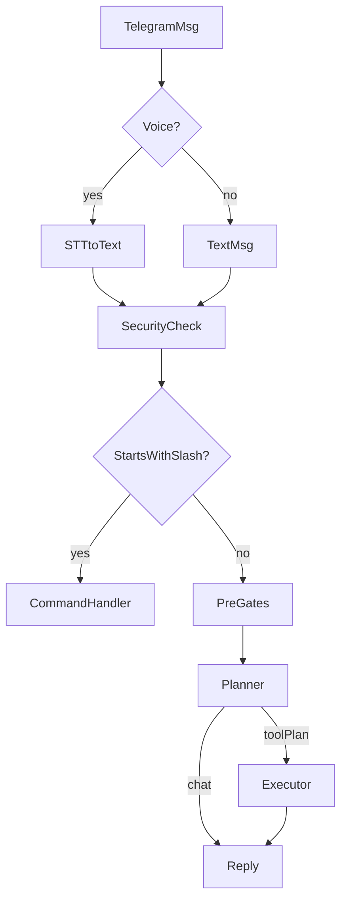
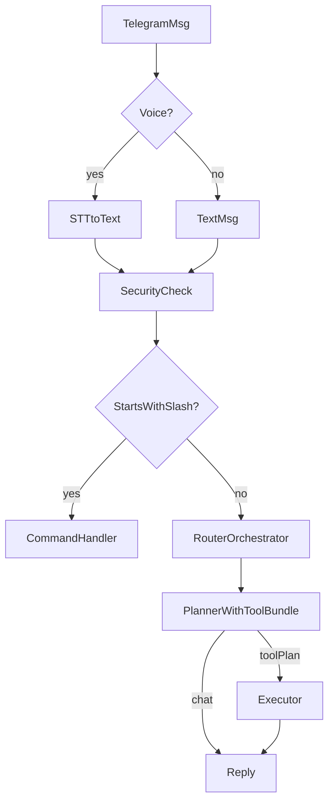

# Оркестратор + исполнитель (big-bang)

## Цели

- Убрать зависимость выбора действий от детерминированных pre-фильтров и списков ключевых слов.
- Сделать выбор домена и tool устойчивым к ошибкам транскрибации (как в Claude Code) за счет LLM-оркестратора.
- Сохранить безопасность и предсказуемость:
  - slash-команды и admin security остаются детерминированными
  - запись preferences только через подтверждение Да/Нет (без автосейва)
- Контекст и претензии к текущему подходу (почему нужен рефакторинг): [`docs/devops/pitfalls.md`](docs/devops/pitfalls.md), раздел "Agent routing: почему детерминированные обертки и списки ключевых слов - тупиковый путь (2026-01-12)".

## Схемы

### Текущий упрощенный флоу



### Целевой флоу (2 LLM шага)



## Дизайн

### 1) Router (оркестратор)

- Новый модуль: [`core/ai/orchestrator_router.js`](core/ai/orchestrator_router.js)
- Вход:
  - `userText` (уже транскрибированный)
  - `isAdmin` (для выбора доступных админ-инструментов)
  - минимальный контекст: `memorySummary`, `chatSummary`, `chatHistory` (как сейчас в planner)
- Выход (строгий JSON), пример структуры:
```json
{
  "bundle": "tasks|ideas|social|journal|memory|chat",
  "confidence": 0.0,
  "rewrite": "...",
  "notes": "..."
}
```

- Модель:
  - по умолчанию `TG_ROUTER_MODEL || TG_AI_MODEL || AI_MODEL`
  - цель: семантическая интерпретация даже при кривой транскрибации

### 2) Tool bundles

- Новый модуль: [`core/ai/tool_bundles.js`](core/ai/tool_bundles.js)
- Маппинг bundle -> список разрешенных tool names.
  - `tasks`: notion task tools
  - `ideas`: notion ideas tools
  - `social`: notion social tools
  - `journal`: notion journal tools
  - `memory`: memory tools (см. ниже)
  - `chat`: без tools

### 3) Planner (исполнитель) с ограниченным набором tools

- Доработать [`core/ai/agent_planner.js`](core/ai/agent_planner.js):
  - добавить параметр `allowedTools` (строки tool names)
  - генерировать system prompt так, чтобы модель выбирала только из `allowedTools`
  - добавить правила про память:
    - никогда не утверждать "сохранил" без tool
    - для "запомни/добавь в память" выбирать bundle `memory` или задавать уточняющий вопрос

### 4) Memory tool: propose save preference

- Добавить новый tool name: `memory.suggest_preference`
- Реализация: либо в [`core/dialogs/todo_bot_executor.js`](core/dialogs/todo_bot_executor.js) (расширить executor), либо как тонкий pre-dispatch в [`core/dialogs/todo_bot.js`](core/dialogs/todo_bot.js) (обработать `memory.*` до передачи в executor).
- Поведение:
  - запускает существующий extractor [`core/ai/preference_extractor.js`](core/ai/preference_extractor.js)
  - создает suggestion в Postgres и показывает UI Да/Нет
  - если model решила, что данных недостаточно, она должна вернуть chat с уточнением (без хардкода в коде)

### 5) Интеграция в text и voice пайплайны

- [`core/dialogs/todo_bot.js`](core/dialogs/todo_bot.js)
  - для всех не-slash и не-stateful сообщений заменить прямой вызов planner на связку Router -> PlannerWithToolBundle
  - убрать/ослабить pre-гейты, которые перехватывают "запомни" до planner (чтобы не было молчания)
- [`core/dialogs/todo_bot_voice.js`](core/dialogs/todo_bot_voice.js)
  - после STT всегда идти в Router -> PlannerWithToolBundle
  - убрать детерминированный ранний вызов `maybeSuggestPreferenceFromText` (теперь это задача memory bundle)

### 6) Набор детерминированных правил, которые оставляем

- Slash-команды и UI state машины:
  - `/...` handlers
  - `/addtask` pending flow
  - переключатели тестовой борды
- Security:
  - admin-only gate по `chat_id`
- Постгрес-операции:
  - запись preferences только после подтверждения Да

## Валидация

- Voice кейсы с ошибками транскрибации:
  - "запомни ..." в разных формах, с пропусками/склейками
  - ожидание: либо UI Да/Нет, либо уточняющий вопрос от модели
- Tasks кейсы:
  - "покажи задачи ...", "найди ...", "удали ..." (проверить что tool bundle tasks выбирается корректно)
- Admin команды:
  - не должны ломаться, остаются детерминированными

## Логи и документация

- Обновить [`docs/current/ai.md`](docs/current/ai.md) описанием Router/Planner и env переменных.
- Обновить [`docs/current/commands.md`](docs/current/commands.md) если добавятся новые команды диагностики.
- Записать sprint в `execution_history/` и обновить `execution_history/index.md`.
- Поднять версию `apps/todo_bot/package.json`.

## Коммиты и пуш

- Перед коммитом согласовать список изменений.
- Коммит и push делать только после явного подтверждения.